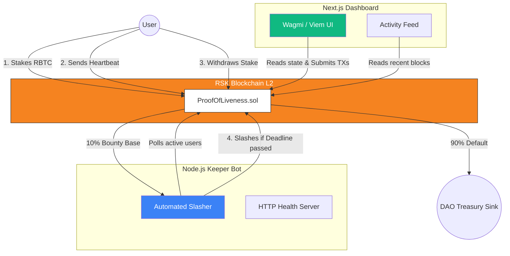

<div align="center">
  <h1>Liveness Vault</h1>
  <p><b>A Trustless Proof-of-Liveness Cryptoeconomic Protocol on Rootstock (RSK)</b></p>
  
  <p>
    <a href="https://explorer.testnet.rootstock.io/"></a>
    <a href="#license"></a>
    
  </p>

  ### 🔗 Quick Links
  **[Live Dashboard](https://liveness-vault.vercel.app)** | **[Verified Contract](https://explorer.testnet.rootstock.io/address/0xA51CbD66985DDD1a04858d8bE11bF26BE32f3870?tab=txs)**
</div>

---

## Overview

**Liveness Vault** is a primitive smart contract system built on Rootstock (Bitcoin layer 2) that enforces participant liveness using game theory and cryptoeconomic staking. 

Participants stake a fixed amount of RBTC to join a cohort or pool. To prove they are active, they must ping the blockchain by sending periodic "heartbeats". If they fail to send a heartbeat within the required interval, their stake becomes vulnerable. Any external actor (a "keeper") can slash them, earning a 10% bounty, while the remaining 90% is sent to a predefined sink (e.g., a DAO treasury or burn address).

---

## Core Functionalities

- **Trustless Liveness Proofs**: No central authority determines if a user is active. The blockchain enforces strict time-based constraints purely dependent on user transactions.
- **Voluntary Exits**: Active participants can call `withdraw()` at any time to reclaim 100% of their staked RBTC and cleanly exit the protocol.
- **Permissionless Slashing Bounty**: The slashing mechanism relies on selfish economic behavior. Keepers are highly incentivized to execute the `slash()` function on stale participants to harvest the 10% bounty reward.
- **Hardened Smart Contract**: Uses complete Checks-Effects-Interactions (CEI) patterns, manual boolean Reentrancy Guards, and invariant validation to ensure funds are completely immune to theft.

---

## Use Cases

This time-based staking primitive serves as a building block for various web3 scenarios:

1. **DAO Contributor Cohorts & Bounties**: 
   When onboarding a new cohort of contributors, a DAO can require an upfront stake. Participants who vanish without contributing lose their stake to the treasury, while active ones can eventually withdraw theirs.
2. **Validator / Node Operator Check-ins**:
   Off-chain infrastructure operators can be required to ping this smart contract. If an operator's node drops offline, another keeper can slash their bond.
3. **Dead Man's Switch Orchestration**:
   As a complementary layer to inheritance protocols, the vault tracks the asset owner. When the heartbeat finally lapses, the protocol knows the owner is incapacitated and can trigger fund distribution logic.

---

## System Architecture

The project consists of three independent but fully integrated layers:



### 1. The Smart Contract (`/contracts`)
A Foundry-based Solidity setup utilizing version `0.8.20`. 
- **Security First**: 74 tests verify all logic, edge cases, game-theoretic behaviors, and stateful invariants with 8192-call depth handlers.
- **Gas Optimized**: Uses manual boolean switches for `nonReentrant` in place of heavier generic libraries.

### 2. The Keeper Bot (`/backend`)
A resilient TypeScript Node.js backend runner.
- **Exponential Backoff**: Handles overloaded public RPC endpoints using exponential jitter retries.
- **Pagination**: Eth-logs are fetched safely across 2000-block boundaries to respect RSK node limits.
- **Prioritization**: Automatically sorts the active user list and slashes the most historically overdue accounts first.

### 3. The Dashboard (`/frontend`)
A sleek, glassmorphic Next.js App Router workspace utilizing wagmi v3 and viem.
- **Live Visuals**: Shows ticking HH:MM:SS localized deadlines and animated CSS pulse status indicators.
- **Recent Blocks**: Activity feed uses `getLogs` directly on public HTTP endpoints to retrieve the latest joins and slashes automatically.

---

## Getting Started

### Prerequisites
- Node.js (>= 18)
- `pnpm` package manager
- [Foundry](https://book.getfoundry.sh/getting-started/installation) (Forge)

### Installation & Builds

```bash
# Install dependencies across all workspaces
pnpm install

# Compile contracts
cd contracts && forge build

# Run contract test suite
forge test -vvv
```

### Deploying to Rootstock Testnet

```bash
cd contracts

# Create your .env from .env.example
# Ensure PRIVATE_KEY is populated
cp .env.example .env

# Deploy using RSK legacy transactions
forge script script/Deploy.s.sol \
  --rpc-url https://public-node.testnet.rsk.co \
  --broadcast \
  --private-key $PRIVATE_KEY \
  --legacy
```
> **❗ Note:** The `--legacy` flag is mandatory because the RSK EVM evaluates transactions as pre-EIP-1559 types.

### Running the System Locally

**1. Keep the Watcher Bot Running:**
```bash
cd backend
# Point .env CONTRACT_ADDRESS to your deployment
cp .env.example .env  
pnpm start
```
*Health endpoints are accessible at `http://localhost:3001/health`*

**2. Start the Frontend Application:**
```bash
cd frontend
# Populate the public NEXT_PUBLIC_CONTRACT_ADDRESS
cp .env.example .env
pnpm run dev
```
*Access the dashboard at `http://localhost:3000`*

---

## 🧪 Security & Auditing

This protocol utilizes an exhaustive, paranoid test-suite ensuring complete logical isolation and zero fund leakage.

| Suite Type | Execution | Objective |
|---|---|---|
| **Unit Testing** | `ProofOfLiveness.t.sol` | Checks standard behaviors and enforces that every custom Error triggers accurately under false contexts. |
| **Exploit Sims** | `ProofOfLiveness.t.sol` | Utilizes isolated attacker contracts replicating standard Reentrancy hacks on both withdrawing and slashing. |
| **Game Theory** | `GameTheory.t.sol` | Fuzzes variables to ensure it is always mathematically impossible to reclaim slashed stakes or double slash accounts. |
| **Invariant** | `ProofOfLiveness.invariant.sol` | 8192 depth stateless calls guaranteeing Total Stakes `==` Contract Balance and Active Statuses never misalign. |

---

## 📜 License

Distributed under the MIT License. See `LICENSE` for more information. Built for the Rootstock (RSK) ecosystem.
